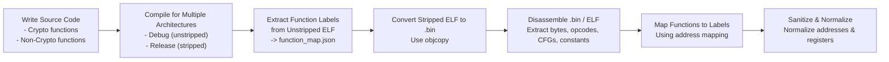
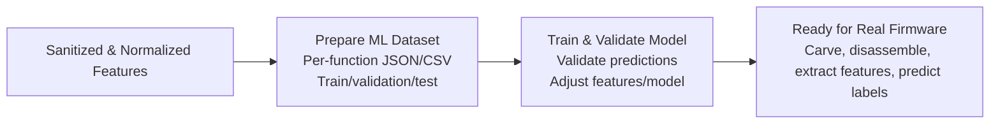
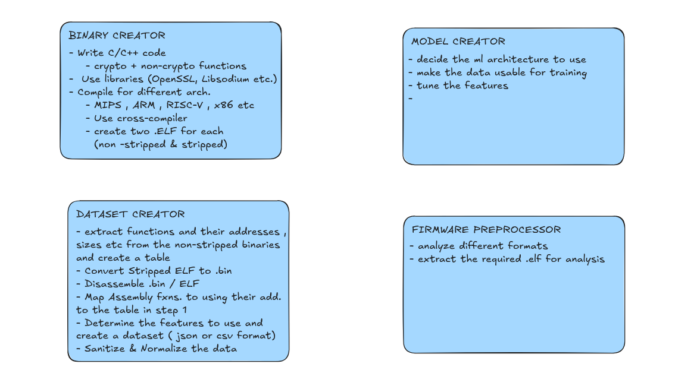

# binary-analyzer

### Problem Statement Title	
AI/ML-Based Identification of Cryptographic Primitives and Protocols in Multi-Architecture Firmware Binaries

### Description

Background
The rapid proliferation of embedded systems in IoT, automotive, industrial, and consumer devices has led to increased use of cryptographic mechanisms to ensure confidentiality, integrity, and authentication. However, the widespread deployment of proprietary or undocumented firmware often obscures the presence and nature of cryptographic functions, especially when symbol information is stripped or the implementation is obfuscated.

Traditional static and dynamic analysis techniques are limited in scale, manual in nature, and architecture-specific. With the diversity of instruction sets (ARM, z80, AVR, MIPS, RISC-V, etc.), and the usage of both standard and proprietary cryptographic algorithms, there is a growing need for intelligent tools that can automatically detect, classify, and analyze cryptographic routines and protocols embedded in firmware binaries.

Recent advances in machine learning (ML), particularly in code embeddings, function similarity, and graph-based learning, offer promising solutions for automating cryptographic function identification and functionality inference at scale.

Description
The above problem statement aims to develop a unified AI/ML-based framework to automatically identify and interpret cryptographic primitives and protocol implementations in firmware binaries of heterogeneous architectures, including scenarios where the firmware is a black-box (i.e., no source code or symbols are available).

The approach to the solution may begin with the controlled creation and compilation of crypto and non-crypto binaries for multiple instruction set architectures (ISAs) using standard crypto libraries. An annotated binary dataset may first be created, appropriate features to be extracted and further the dataset created along with features can be used for training and validation to build models that can detect crypto routines, distinguish standard vs proprietary algorithms, identify crypto protocol structure (e.g., handshake, key exchange) and infer high-level functionality (e.g., encryption, authentication, signing). Further the model can be extended to work on black-box firmware images extracted from real devices.

Expected Solution
A portable and modular AI/ML-based system for cryptographic primitives in firmware. The models should be capable of identifying known and potentially proprietary crypto implementations and should classify types of crypto (AES, RSA, ECC, SHA, XOR, PRNG, etc.). It should detect cryptographic protocol patterns and states. The model should provide insights into crypto protocol behaviours in black-box firmware. The model should be evaluated for its detection accuracy, precision, recall, and false positives.


### Workflow





### Tasks Distribution




### File Structure

```
./
├── binary_creator/          # Creates raw binaries (crypto + non-crypto)
│   ├── build_scripts/       # Scripts to compile source code for multiple architectures
│   ├── outputs/             # Compiled binaries
│   │   ├── non-stripped/    # Binaries with debug info (used for labeling)
│   │   └── stripped/        # Binaries without symbols (simulate real firmware)
│   ├── src/                 # Source code repository
│   │   ├── crypto/          # Crypto algorithm implementations
│   │   └── non-crypto/      # Non-crypto example functions
│   └── workspace/           # Temporary build/test files
│
├── dataset_creator/         # Converts binaries into labeled datasets
│   ├── outputs/
│   │   ├── dataset/         # Final clean dataset (CSV/JSON) for ML
│   │   └── function_maps/   # Ground-truth mapping of functions to labels
│   ├── scripts/             # Python scripts for feature extraction & labeling
│   └── workspace/           # Temp files or intermediate results
│
├── docs/                    # Documentation
│   └── assets/              # Images, diagrams, and other documentation assets
│    
├── firmware_preprocessor/   # Handles real-world firmware files
│   ├── outputs/             # Extracted binaries/code from real firmware
│   ├── prebuild_binaries/   # Original firmware files to analyze
│   ├── scripts/             # Tools like Binwalk to extract and preprocess firmware
│   └── workspace/           # Temp extraction and analysis files
│
├── model_creator/           # AI/ML model building and training
│   ├── models/              # Trained AI models
│   ├── notebooks/           # Experiments, data exploration, model prototyping
│   ├── scripts/             # Training and prediction scripts
│   └── workspace/           # Temp files, checkpoints, or intermediate results
└── README.md                # Project overview and instructions
```